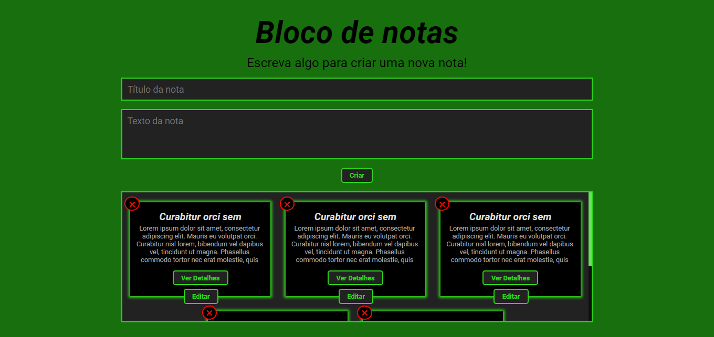
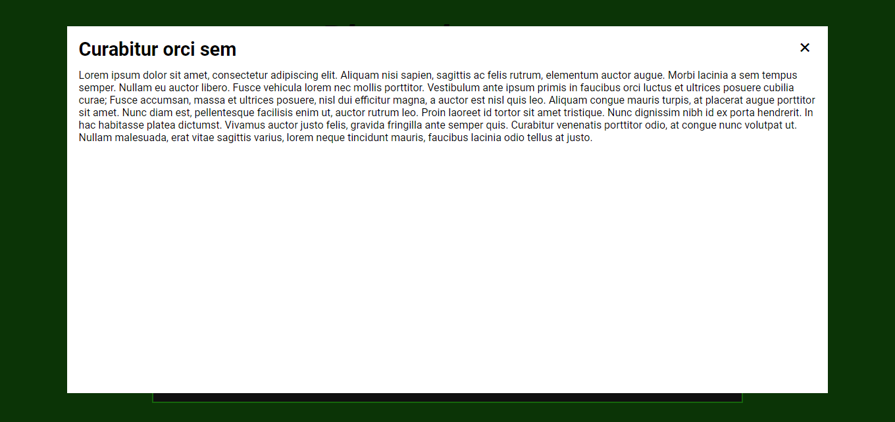

<h1 align="center">Bloco de Notas</h1>

Um bloco de notas onde você pode adicionar, ver, remover e editar suas notas.

Sumário
===========
<!--ts-->
  * [Sobre](#sobre)
  * [Screenshot](#screenshot)
  * [Como usar](#como-usar)
  * [Status](#status)
  * [Funcionalidades](#funcionalidades)
  * [Tecnologias](#tecnologias)
  * [Autor](#autor)
<!--te-->

Sobre
-----

Eu fiz esse site há um tempo atrás para treinar e praticar JavaScript, inicialmente o projeto foi feito HTML, CSS e JavaScript e suas funcionalidades eram apenas de criar notas e visualizá-las.

Com a criação do meu portfólio, eu queria fazer um projeto com as propriedades de criar, remover, visualizar e editar.

Então tive a ideia de melhorar esse projeto adicionando mais funcionalidades e mudando algumas coisas no código antigo. Algumas das principais mudanças foram o idioma, o uso de Sass ao invés de CSS puro, o usuário poder criar o título da nota, além das funcões de remover e editar as notas.

Meu principal intuito com esse projeto foi aprimorar e mostrar minhas habilidades em manipular elementos HTML com JavaScript.

Screenshot
----------

Como Usar
---------

Você pode acessar o site clicando <a href="https://bloco-de-notas-inky.vercel.app/">aqui</a> ou abrindo o arquivo HTML em um navegador.

Com o site aberto, você deve colocar título e texto na sua nota, ao clicar em 'Criar", uma nova nota será criada na aréa abaixo do botão.

Caso queira remover alguma nota, você pode clicar no botão "X" no canto superior esquerdo para excluir aquela nota.

Ao clicar em "Ver Detalhes" será aberto uma janela com todo o conteúdo da nota, para fechar a janela você pode clicar no "X", clicar fora da janela ou apertando a tecla "ESC".

Se você deseja editar o conteúdo de alguma nota, basta clicar no botão "Editar". O conteudo da nota aparecerá nos campos de título e texto enquanto a nota será removida. Sendo assim, após a edição clique novamente no botão criar para recriar a nota editada.

Status
------
Concluído :heavy_check_mark:

Funcionalidades
---------------
- [x] Criar notas
- [x] Visualizar as notas
- [X] Excluir as notas
- [x] Editar as notas

Tecnologias
-----------

  
  
  
  

Autor
------
<h3 align="center">Rafael Tavares</h3>

 <a href="https://www.facebook.com/rafael.tavares.39904/" target="_blank"></img></a>
 <a href="https://www.instagram.com/rafatavares03/" target="_blank"></img></a>
 

